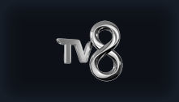

<div align="center">
  
  <h1>Anthology</h1>
  <p><strong>Nuvio için Doğrulanmış Türkçe Film, Dizi, Anime, Canlı TV ve Zengin Katalog Eklenti Deposu</strong></p>

  <p>
    
    
    
    
    
  </p>

  <a href="https://falsisdev.github.io/anthology">🌐 Web Sitesi</a> &nbsp;|&nbsp;
  <a href="#-kurulum-rehberi-çift-katmanlı-kusursuz-deneyim">📲 Kurulum</a> &nbsp;|&nbsp;
  <a href="#-canlı-tv-katalogları-6-katalog">📚 Canlı TV Katalogları</a> &nbsp;|&nbsp;
  <a href="#-doğrulanmış-eklentiler-37-aktif">🎬 Eklentiler (37)</a> &nbsp;|&nbsp;
  <a href="#-canlı-tv--spor-kanalları">📡 Canlı TV & Spor</a>
</div>

---

## 📲 Kurulum Rehberi (Çift Katmanlı Kusursuz Deneyim)

Nuvio ve Stremio'da yerli dizileri, animeleri, çizgi dizileri ve **100 Canlı TV kanalını** hem **ana sayfada vitrin olarak görmek** hem de **doğrulanmış resmi CDN akışlarıyla doğrudan oynatmak** için aşağıdaki adımları tamamlayın:

---

### 1️⃣ Adım: Video Oynatma Motorunu Ekleyin (Nuvio Pluginleri)
Bu adım, bir içerik açtığınızda arka planda çalışan 37 Türkçe/yabancı video scraper'ını Nuvio oynatıcısına yükler.

1. **Nuvio** uygulamasında **Ayarlar** → **Genel** → **İçerik & Keşif** → **Pluginler** → **Depo Ekle** bölümüne gidin.
2. Aşağıdaki bağlantıyı yapıştırıp **Ekle** butonuna basın:

```text
https://raw.githubusercontent.com/falsisdev/anthology/main/manifest.json
```

---

### 2️⃣ Adım: Canlı TV Ana Sayfa Kataloglarını Ekleyin (Anthology — Canlı TV)
Bu adım; 100 Canlı TV kanalını 6 kategoride (**Tüm Kanallar**, **Ulusal**, **Canlı Spor**, **Canlı Haber**, **Belgesel & Çocuk**, **Müzik & Eğlence**) **Nuvio veya Stremio'nun ana sayfa vitrinine** taşır. Tüm kanalların kapakları standart **221x126** banner formatındadır.

1. **Nuvio** veya **Stremio** uygulamasında **Eklentiler / Addons** → **Depo / Addon Ekle** bölümüne gidin.
2. Aşağıdaki statik katalog bağlantısını yapıştırıp **Ekle / Install** butonuna basın:

```text
https://falsisdev.github.io/anthology/stremio/manifest.json
```
*(Alternatif GitHub Raw bağlantısı: `https://raw.githubusercontent.com/falsisdev/anthology/main/stremio/manifest.json`)*

---

> [!TIP]
> **Nasıl Birlikte Çalışırlar?**
> Nuvio veya Stremio'da 2. Adımı eklediğinizde ana sayfanızda **Anthology — Canlı TV** vitrinleri (Tüm Kanallar, Ulusal Kanallar, Canlı Spor, Canlı Haber, Belgesel & Çocuk, Müzik & Eğlence) görünür. Dilediğiniz kanala tıkladığınız anda resmi CDN akışları (`.m3u8`) üzerinden canlı yayın kesintisiz başlar. 1. Adım ise Nuvio içerisinde film, dizi ve animeleri en yüksek kalitede izlemenizi sağlayan video motorudur.

---

## 📚 Canlı TV Katalogları (6 Katalog)

Nuvio ve Stremio ana ekranında canlı TV kanallarını kategorilere ayrılmış vitrinler olarak sunan resmi kataloglar:

| Katalog | Sağlayıcı | Tür | Kanal Sayısı | Açıklama |
|---|---|:---:|:---:|---|
|  **📺 Canlı TV — Tüm Kanallar** | `ListM3u.js` | Canlı TV | 100 | Türkiye'nin tüm ulusal, haber, spor, belgesel, çocuk ve müzik kanalları |
|  **🇹🇷 Ulusal Kanallar** | `anthology_ulusal.js` | Canlı TV | 19 | TRT 1, ATV, Kanal D, Show, Star, NOW, TV8, TVNET, Ülke TV, TRT World vb. |
|  **⚽ Canlı Spor** | `anthology_spor.js` | Canlı TV | 49 | TRT Spor, A Spor, HT Spor, FB TV, TJK TV, BeIN Sports, S Sport, Tivibu |
|  **📰 Canlı Haber** | `anthology_haber.js` | Canlı TV | 18 | NTV, Habertürk, TRT Haber, TV100, Sözcü TV, Ülke TV, Ekotürk, TVNET |
|  **🦁 Belgesel & Çocuk** | `anthology_belgesel_cocuk.js` | Canlı TV | 7 | TRT Belgesel, Minika Çocuk, Minika GO, TRT Çocuk, TRT EBA İlkokul/Orta/Lise |
|  **🎵 Müzik & Eğlence** | `anthology_muzik.js` | Canlı TV | 7 | Kral Pop TV, Power TV, PowerTürk TV, Number 1 TV, Power Dance, TRT Müzik |

---

## 🎬 Doğrulanmış Eklentiler (37 Aktif)

> [!NOTE]
> Tüm eklentiler doğrudan Nuvio video oynatıcısına uygun `.m3u8` HLS veya `.mp4`/`.mkv` doğrudan akışları döndürür. Bozuk iframe veya oynatılamayan bağlantı kesinlikle içermez.

### 🍿 Film Kaynakları & Tür Paketleri

| Eklenti | Kaynak / Altyapı | Kalite & Format | İçerik Detayı |
|---|---|:---:|:---:|
|  **Anthology Film (M3U)** | Lunedor / Zerk / PowerBoard | 1080p HLS | Dublaj & Altyazı Film Arşivi |
|  **Anthology Aksiyon & Macera** | Lunedor & Zerk HLS Master | 1080p HLS | Aksiyon, Suç ve Gerilim Sineması |
|  **Anthology Bilim Kurgu** | Lunedor & Zerk HLS Master | 1080p HLS | Bilim Kurgu, Uzay ve Fantastik |
|  **Anthology Korku & Gerilim** | Lunedor & Zerk HLS Master | 1080p HLS | Korku, Gizem ve Gerilim |
|  **Anthology Komedi** | Lunedor & Zerk HLS Master | 1080p HLS | Yerli & Yabancı Komedi |
|  **Anthology Animasyon** | Lunedor & Zerk HLS Master | 1080p HLS | Animasyon & Çizgi Sinema |
|  **Anthology Yerli Film & Yeşilçam** | Zerk & Lunedor Türk Sineması | 1080p HLS / MP4 | Klasik Yeşilçam & Yerli Sinema |
|  **Anthology Belgesel & Doğa** | Lunedor & Zerk Belgesel Arşivi | 1080p HLS | Doğa, Bilim ve Tarih Belgeselleri |
|  **Anthology Çocuk & Aile** | Lunedor & Zerk Aile Arşivi | 1080p HLS | Aile & Çocuk Sineması |
|  **Anthology IMDb Top Rated** | En Yüksek Puanlı Başyapıtlar | 1080p HLS | Kült & IMDb Top 250 Ödüllü Sinema |
| **FilmModu** | filmmodu.one (ImgsAPI) | 4K & 1080p HLS | Dublaj & Altyazı Seçenekleri |
| **DiziPal** | dizipal2127.com (Imagestoo) | 1080p HLS | Dublaj & Altyazı Seçenekleri |
| **JetFilmİzle** | jetfilmizle.now (Videopark & PlayerX) | 1080p MP4 / HLS | Dublaj & Çoklu Dil Seçenekleri |
| **SinemaCX** | sinema.gg (Player.filmizle.in) | 1080p HLS | Dublaj & Altyazı Seçenekleri |
| **SineWix** | sinewix (snwixdepo) | 1080p Direct MKV | Çift Ses DUAL |
| **Vidlink** | vidlink.pro (Global CDN) | 4K & 1080p MP4 | Türkçe & Global Çok Dilli |
| **Vidmody** | vidmody.com (Multi-Audio HLS) | 1080p HLS | Çift Ses (Türkçe & İngilizce) + Altyazı |
| **Webteİzle** | webteizle.info (VidMoly Master) | 1080p HLS | Dublaj & Altyazı Seçenekleri |

### 📺 Dizi Kaynakları & Arşivleri

| Eklenti | Kaynak / Altyapı | Kalite & Format | İçerik Detayı |
|---|---|:---:|:---:|
| **Mahsun Dizi** | mahsundizi8.com (DosyaLoad BEPLAYER+) | 1080p HLS | Popüler Yabancı Diziler & Filmler (TR/EN Altyazı) |
| **DDizi** | ddizi.im (Fast CDN / Akamai / Google Direct) | 1080p MP4 / HLS | Yerli Dizi & Güncel Bölümler Arşivi |
| **DiziBox** | dizibox.live (VidMoly Master) | 1080p HLS Master | Popüler Yabancı Diziler Arşivi |
| **DiziMom** | dizimom.diy (HDPlayer Fire HLS) | 1080p HLS Master | Popüler Yabancı Diziler (Dublaj & Altyazı) |
|  **Anthology Dizi (M3U)** | Zerk / Ciner CDN | 1080p MP4 / HLS | Yerli & Yabancı Dizi Arşivi |
|  **Anthology Yerli Dizi** | Ciner & Zerk CDN | 1080p MP4 / HLS | Güncel & Klasik Türk Dizileri |
|  **Anthology Yabancı Dizi** | Zerk DUAL Master CDN | 1080p HLS | Popüler Yabancı Dizi Arşivi |
| **YabancıDizi** | yabancidizi.news (VidMoly Master) | 1080p HLS | Popüler Yabancı Diziler (Dublaj & Altyazı) |
| **SezonlukDizi** | sezonlukdizi.cc (VidMoly) | 1080p HLS | Dublaj & Altyazı |
| **DiziPal** | dizipal2127.com (FormationFeed) | 1080p HLS | Dublaj & Altyazı |
| **DiziYou** | diziyou.one (Storage CDN) | 1080p HLS | Dublaj + TR VTT |
| **SineWix** | sinewix (snwixdepo) | 1080p Direct MKV | Çift Ses DUAL |
| **Vidlink** | vidlink.pro (Global CDN) | 1080p MP4 | Türkçe & Global |
| **Vidmody** | vidmody.com (Multi-Audio HLS) | 1080p HLS | Çift Ses (Türkçe & İngilizce) + Altyazı |

### ⛩️ Anime & Çizgi Dizi Kaynakları

| Eklenti | Kaynak / Altyapı | Kalite & Format | Dil Desteği |
|---|---|:---:|:---:|
| **AnimeciX** | animecix.tv (TauVideo CDN) | 1080p / 720p / 480p MP4 | Türkçe Altyazı |
| **ÇizgiMax** | cizgimax.online (TauVideo & Sibnet) | 1080p / 720p Direct MP4 | Dublaj & Altyazı |
| **TurkAnime** | turkanime.tv (Sibnet & ArtPlayer) | 1080p MP4 / HLS | Türkçe Altyazı |

### 📡 Canlı TV & Spor Paketleri

| Eklenti | Kaynak / Altyapı | Kanal Sayısı | İçerik Detayı |
|---|---|:---:|:---:|
|  **Anthology Canlı TV** | M3U Canlı Akış Kataloğu | 80+ Kanal | Tüm Ulusal, Spor, Haber ve Belgesel |
|  **Anthology Canlı Spor** | Yüksek Hızlı Spor Akışları | 49 Kanal | BeIN Sports 1-5, S Sport, Exxen Spor, Tivibu |
|  **Anthology Canlı Haber** | 7/24 Kesintisiz Haber | 18 Kanal | NTV, Habertürk, TRT Haber, Sözcü TV, CNN Türk, TVNET, Ülke TV |
|  **Anthology Ulusal Kanallar** | Ulusal Televizyon Yayınları | 18 Kanal | TRT 1, ATV, Kanal D, Show, Star, TV8, NOW, TVNET, Ülke TV |
|  **Anthology Belgesel & Çocuk** | Belgesel ve Çocuk Kanalları | 7 Kanal | TRT Belgesel, Minika Çocuk, Minika GO, TRT Çocuk, TRT EBA |
|  **Anthology Müzik & Eğlence** | 7/24 Canlı Müzik & Video Klip | 7 Kanal | Kral Pop TV, Power TV, PowerTürk TV, Number 1 TV, Power Dance |

---

## 📡 Canlı TV & Spor Kanalları (100 Kanal)

### ⚽ Spor Kanalları (49 Canlı Kanal)

<div align="center">
   &nbsp;&nbsp;
   &nbsp;&nbsp;
   &nbsp;&nbsp;
   &nbsp;&nbsp;
   &nbsp;&nbsp;
   &nbsp;&nbsp;
   &nbsp;&nbsp;
  
</div>

<br>

-  **BeIN Sports:** BeIN Sports 1, 2, 3, 4, 5 & Max 1, Max 2 HD
-  **S Sport:** S Sport 1 HD, S Sport 2 HD & S Sport Plus HD
-  **Tivibu Spor:** Tivibu Spor HD, Tivibu Spor 1, 2, 3, 4 HD
-  **Exxen Spor:** Exxen TV & Exxen Spor 1, 2, 3, 4, 5, 6, 7, 8 HD
-  **Ulusal & Diğer Spor:** TRT Spor HD, TRT Spor Yıldız HD, A Spor HD, HT Spor HD, TV8,5 HD, Smart Spor 1-2, EuroSport 1-2, NBA TV, FB TV, TJK TV, Sports TV, CBC Sport, iDMAN TV

### 📺 Ulusal, Haber, Belgesel & Müzik Kanalları

<div align="center">
   &nbsp;&nbsp;
   &nbsp;&nbsp;
   &nbsp;&nbsp;
   &nbsp;&nbsp;
   &nbsp;&nbsp;
   &nbsp;&nbsp;
   &nbsp;&nbsp;
   &nbsp;&nbsp;
   &nbsp;&nbsp;
  
</div>

<br>

-  **Ulusal Kanallar (19 Kanal):** TRT 1, ATV, Kanal D, Show TV, Star TV, NOW TV, TV8, Kanal 7, Beyaz TV, Teve2, A2 TV, TV360, TRT 2, TRT Türk, Kanal 7 Avrupa, TRT World, TRT Avaz, TRT Kurdî, TRT Arabi
-  **Haber Kanalları (18 Kanal):** TRT Haber, NTV, Habertürk, TV100, A Haber, Halk TV, Tele 1, TGRT Haber, Haber Global, 24 TV, Bloomberg HT, TVNET, Ülke TV, Ekotürk, Bengü Türk, Flash Haber, Lider Haber, Türk Haber
-  **Belgesel & Çocuk (7 Kanal):** TRT Belgesel HD, Minika Çocuk HD, Minika GO HD, TRT Çocuk HD, TRT EBA İlkokul, TRT EBA Ortaokul, TRT EBA Lise
-  **Müzik & Eğlence (7 Kanal):** Kral Pop TV HD, Power TV HD, PowerTürk TV HD, Number 1 TV HD, Power Dance HD, Power Love HD, TRT Müzik HD

---

## 🧪 Test ve Doğrulama

Tüm canlı TV eklentileri, katalogları ve sağlayıcılar entegrasyon testleriyle doğrulanabilir:

```bash
# Stremio Anthology — Canlı TV eklentisinin bütünlük ve meta testini çalıştırın:
node scripts/test_stremio_addon.js

# Tüm katalogların öğe çekme testini çalıştırın:
node scripts/test_all_catalogs.js
```
