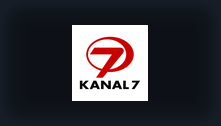

<div align="center">
  
  <h1>Anthology</h1>
  <p><strong>Nuvio için Doğrulanmış Türkçe Film, Dizi, Anime, Canlı TV ve Zengin Katalog Eklenti Deposu</strong></p>

  <p>
    
    
    
    
    
  </p>

  <a href="https://falsisdev.github.io/anthology">🌐 Web Sitesi</a> &nbsp;|&nbsp;
  <a href="#-kurulum">📲 Kurulum</a> &nbsp;|&nbsp;
  <a href="#-zengin-kataloglar-13-katalog">📚 Zengin Kataloglar</a> &nbsp;|&nbsp;
  <a href="#-doğrulanmış-eklentiler-31-aktif">🎬 Eklentiler (31)</a> &nbsp;|&nbsp;
  <a href="#-canlı-tv--spor-kanalları">📡 Canlı TV & Spor</a>
</div>

---

## 📲 Kurulum Rehberi (Çift Katmanlı Kusursuz Deneyim)

Nuvio'da yerli dizileri, animeleri, çizgi dizileri ve canlı TV kanallarını hem **ana sayfada vitrin (katalog) olarak görmek** hem de tıkladığınızda **en yüksek kalitede doğrudan oynatmak** için iki adımlı kurulumu tamamlayın:

---

### 1️⃣ Adım: Video Oynatma Motorunu Ekleyin (Pluginler)
Bu adım, bir içerik açtığınızda arka planda çalışan 31 Türkçe/yabancı video scraper'ını Nuvio oynatıcısına yükler.

1. **Nuvio** uygulamasında **Ayarlar** → **Genel** → **İçerik & Keşif** → **Pluginler** → **Depo Ekle** bölümüne gidin.
2. Aşağıdaki bağlantıyı yapıştırıp **Ekle** butonuna basın:

```text
https://raw.githubusercontent.com/falsisdev/anthology/main/manifest.json
```

---

### 2️⃣ Adım: Ana Sayfa Keşif Kataloglarını Ekleyin (Eklentiler)
Bu adım; popüler yerli dizileri (DDizi), güncel yabancı dizileri (DiziBox, DiziMom), popüler film ve dizileri (SineWix), animeleri (AnimeciX, TurkAnime), nostaljik çizgi dizileri (ÇizgiMax) ve 80+ Canlı TV/Spor kanalını **Nuvio'nun ana sayfa vitrinine** taşır.

1. **Nuvio** uygulamasında **Ayarlar** → **Genel** → **İçerik & Keşif** → **Eklentiler** → **Depo Ekle** bölümüne gidin.
2. Aşağıdaki statik katalog bağlantısını yapıştırıp **Ekle** butonuna basın:

```text
https://falsisdev.github.io/anthology/stremio/manifest.json
```
*(Alternatif GitHub Raw bağlantısı: `https://raw.githubusercontent.com/falsisdev/anthology/main/stremio/manifest.json`)*

---

> [!TIP]
> **Nasıl Birlikte Çalışırlar?**
> Nuvio ana sayfasında 2. Adımda eklediğiniz **DDizi**, **DiziBox**, **DiziMom**, **SineWix**, **ÇizgiMax** veya **Canlı TV** vitrinlerini gezebilir, dilediğiniz diziye/bölüme tıklayabilirsiniz. Tıkladığınız anda 1. Adımda kurduğunuz Anthology eklenti motoru devreye girer ve 1080p doğrudan akışı (`.m3u8` / `.mp4`) başlatır. Tamamen sunucusuzdur ve GitHub üzerinden ömür boyu ücretsiz çalışır!

---

## 📚 Zengin Kataloglar (13 Katalog)

Nuvio ana ekranında içerik keşfetmenizi sağlayan yerli/yabancı kataloglar:

| Katalog | Sağlayıcı | Tür | Açıklama |
|---|---|:---:|---|
| **DDizi — Popüler Yerli Diziler** | `ddizi.js` | Dizi (TV) | Güncel ve nostaljik Türk dizileri arşivi (tüm bölümler) |
| **DiziBox — Popüler Yabancı Diziler** | `dizibox.js` | Dizi (TV) | En popüler yabancı diziler (tüm sezon ve bölümler) |
| **DiziMom — Popüler Diziler** | `dizimom.js` | Dizi (TV) | Popüler yabancı diziler ve 1080p Fire HLS master akışları |
| **SineWix — Popüler Filmler** | `sinewix.js` | Film | SineWix platformunun en çok izlenen filmleri |
| **SineWix — Popüler Diziler** | `sinewix.js` | Dizi (TV) | SineWix platformunun en çok izlenen dizileri |
| **FilmModu — Son Eklenen Filmler** | `filmmodu.js` | Film | Güncel vizyon ve dijital platform filmleri |
| **AnimeciX — Popüler Animeler** | `animecix.js` | Anime / Dizi | Trend ve güncel anime serileri (tüm bölümler) |
| **TurkAnime — Popüler Animeler** | `turkanime.js` | Anime / Dizi | Türkiye'nin en popüler animeleri (tüm bölümler) |
| **ÇizgiMax — Çizgi Diziler** | `cizgimax.js` | Çizgi Dizi | Nostaljik ve güncel çizgi diziler (tüm bölümler) |
|  **Anthology Canlı TV** | `ListM3u.js` | Canlı | 80+ ulusal, haber, spor ve belgesel kanalları |
|  **Anthology Canlı Spor** | `anthology_spor.js` | Canlı | BeIN Sports, S Sport, Tivibu, Exxen ve 49 spor kanalı |
|  **Anthology Canlı Haber** | `anthology_haber.js` | Canlı | NTV, Habertürk, TRT Haber ve 14 haber kanalı |
|  **Anthology Ulusal Kanallar** | `anthology_ulusal.js` | Canlı | TRT 1, ATV, Kanal D, Show, Star, TV8, NOW vb. 16 kanal |

---

## 🎬 Doğrulanmış Eklentiler (31 Aktif)

> [!NOTE]
> Tüm eklentiler doğrudan Nuvio video oynatıcısına uygun `.m3u8` HLS veya `.mp4`/`.mkv` doğrudan akışları döndürür. Bozuk iframe veya oynatılamayan bağlantı kesinlikle içermez.

### 🍿 Film Kaynakları & Tür Paketleri

| Eklenti | Kaynak / Altyapı | Kalite & Format | İçerik Detayı |
|---|---|:---:|:---:|
|  **Anthology Film (M3U)** | Lunedor / Zerk / PowerBoard | 1080p HLS | Dublaj & Altyazı Film Arşivi |
|  **Anthology Aksiyon & Macera** | Lunedor & Zerk HLS Master | 1080p HLS | Aksiyon, Suç ve Gerilim Sineması |
|  **Anthology Bilim Kurgu** | Lunedor & Zerk HLS Master | 1080p HLS | Bilim Kurgu, Uzay ve Fantastik |
|  **Anthology Korku & Gerilim** | Lunedor & Zerk HLS Master | 1080p HLS | Korku, Gizem ve Gerilim |
|  **Anthology Komedi** | Lunedor & Zerk HLS Master | 1080p HLS | Yerli & Yabancı Komedi |
|  **Anthology Animasyon** | Lunedor & Zerk HLS Master | 1080p HLS | Animasyon & Çizgi Sinema |
|  **Anthology Yerli Film & Yeşilçam** | Zerk & Lunedor Türk Sineması | 1080p HLS / MP4 | Klasik Yeşilçam & Yerli Sinema |
|  **Anthology Belgesel & Doğa** | Lunedor & Zerk Belgesel Arşivi | 1080p HLS | Doğa, Bilim ve Tarih Belgeselleri |
|  **Anthology Çocuk & Aile** | Lunedor & Zerk Aile Arşivi | 1080p HLS | Aile & Çocuk Sineması |
|  **Anthology IMDb Top Rated** | En Yüksek Puanlı Başyapıtlar | 1080p HLS | Kült & IMDb Top 250 Ödüllü Sinema |
| **FilmModu** | filmmodu.one (ImgsAPI) | 4K & 1080p HLS | Dublaj & Altyazı Seçenekleri |
| **DiziPal** | dizipal2127.com (Imagestoo) | 1080p HLS | Dublaj & Altyazı Seçenekleri |
| **JetFilmİzle** | jetfilmizle.now (Videopark & PlayerX) | 1080p MP4 / HLS | Dublaj & Çoklu Dil Seçenekleri |
| **SinemaCX** | sinema.gg (Player.filmizle.in) | 1080p HLS | Dublaj & Altyazı Seçenekleri |
| **SineWix** | sinewix (snwixdepo) | 1080p Direct MKV | Çift Ses DUAL |
| **Vidlink** | vidlink.pro (Global CDN) | 4K & 1080p MP4 | Türkçe & Global Çok Dilli |

### 📺 Dizi Kaynakları & Arşivleri

| Eklenti | Kaynak / Altyapı | Kalite & Format | İçerik Detayı |
|---|---|:---:|:---:|
| **DDizi** | ddizi.im (Fast CDN / Akamai / Google Direct) | 1080p MP4 / HLS | Yerli Dizi & Güncel Bölümler Arşivi |
| **DiziBox** | dizibox.live (Molystream Sheila) | 1080p HLS Master | Popüler Yabancı Diziler Arşivi |
| **DiziMom** | dizimom.diy (HDPlayer Fire HLS) | 1080p HLS Master | Popüler Yabancı Diziler (Dublaj & Altyazı) |
|  **Anthology Dizi (M3U)** | Zerk / Ciner CDN | 1080p MP4 / HLS | Yerli & Yabancı Dizi Arşivi |
|  **Anthology Yerli Dizi** | Ciner & Zerk CDN | 1080p MP4 / HLS | Güncel & Klasik Türk Dizileri |
|  **Anthology Yabancı Dizi** | Zerk DUAL Master CDN | 1080p HLS | Popüler Yabancı Dizi Arşivi |
| **SezonlukDizi** | sezonlukdizi.cc (VidMoly) | 1080p HLS | Dublaj & Altyazı |
| **DiziPal** | dizipal2127.com (FormationFeed) | 1080p HLS | Dublaj & Altyazı |
| **DiziYou** | diziyou.one (Storage CDN) | 1080p HLS | Dublaj + TR VTT |
| **SineWix** | sinewix (snwixdepo) | 1080p Direct MKV | Çift Ses DUAL |
| **Vidlink** | vidlink.pro (Global CDN) | 1080p MP4 | Türkçe & Global |

### ⛩️ Anime & Çizgi Dizi Kaynakları

| Eklenti | Kaynak / Altyapı | Kalite & Format | Dil Desteği |
|---|---|:---:|:---:|
| **AnimeciX** | animecix.tv (TauVideo CDN) | 1080p / 720p / 480p MP4 | Türkçe Altyazı |
| **ÇizgiMax** | cizgimax.online (TauVideo & Sibnet) | 1080p / 720p Direct MP4 | Dublaj & Altyazı |
| **TurkAnime** | turkanime.tv (Sibnet & ArtPlayer) | 1080p MP4 / HLS | Türkçe Altyazı |

### 📡 Canlı TV & Spor Paketleri

| Eklenti | Kaynak / Altyapı | Kanal Sayısı | İçerik Detayı |
|---|---|:---:|:---:|
|  **Anthology Canlı TV** | M3U Canlı Akış Kataloğu | 80+ Kanal | Tüm Ulusal, Spor, Haber ve Belgesel |
|  **Anthology Canlı Spor** | Yüksek Hızlı Spor Akışları | 49 Kanal | BeIN Sports 1-5, S Sport, Exxen Spor, Tivibu |
|  **Anthology Canlı Haber** | 7/24 Kesintisiz Haber | 14 Kanal | NTV, Habertürk, TRT Haber, Sözcü TV, CNN Türk |
|  **Anthology Ulusal Kanallar** | Ulusal Televizyon Yayınları | 16 Kanal | TRT 1, ATV, Kanal D, Show, Star, TV8, NOW |

---

## 📡 Canlı TV & Spor Kanalları

### ⚽ Spor Kanalları (49 Canlı Kanal)

<div align="center">
   &nbsp;&nbsp;
   &nbsp;&nbsp;
   &nbsp;&nbsp;
   &nbsp;&nbsp;
   &nbsp;&nbsp;
   &nbsp;&nbsp;
   &nbsp;&nbsp;
  
</div>

<br>

-  **BeIN Sports:** BeIN Sports 1, 2, 3, 4, 5 & Max 1, Max 2 HD
-  **S Sport:** S Sport 1 HD, S Sport 2 HD & S Sport Plus HD
-  **Tivibu Spor:** Tivibu Spor HD, Tivibu Spor 1, 2, 3, 4 HD
-  **Exxen Spor:** Exxen TV & Exxen Spor 1, 2, 3, 4, 5, 6, 7, 8 HD
-  **Ulusal & Diğer Spor:** TRT Spor HD, TRT Spor Yıldız HD, A Spor HD, HT Spor HD, TV8,5 HD, Smart Spor 1-2, EuroSport 1-2, NBA TV, FB TV, TJK TV, Sports TV, CBC Sport, iDMAN TV

### 📺 Ulusal, Haber & Belgesel Kanalları

<div align="center">
   &nbsp;&nbsp;
   &nbsp;&nbsp;
   &nbsp;&nbsp;
   &nbsp;&nbsp;
   &nbsp;&nbsp;
   &nbsp;&nbsp;
   &nbsp;&nbsp;
   &nbsp;&nbsp;
   &nbsp;&nbsp;
   &nbsp;&nbsp;
  
</div>

<br>

-  **Ulusal Kanallar (16 Kanal):** TRT 1, ATV, Kanal D, Show TV, Star TV, NOW TV, TV8, Kanal 7, Beyaz TV, Teve2, A2 TV, TV360, TRT 2
-  **Haber Kanalları (14 Kanal):** NTV, Habertürk, TRT Haber, A Haber, Halk TV, Tele 1, TGRT Haber, Haber Global, 24 TV, Bloomberg HT, Bengü Türk, Flash Haber, TVnet
-  **Belgesel & Çocuk:** TRT Belgesel HD, TRT Çocuk HD, TRT Avaz, TRT Müzik, DMAX, TLC

---

## 🧪 Test ve Doğrulama

Tüm sağlayıcılar ve kataloglar otomatik entegrasyon testleriyle doğrulanabilir:

```bash
# Tüm 31 sağlayıcının akış testini çalıştırın:
node scripts/test_all_providers.js

# Tüm 12 kataloğun öğe çekme testini çalıştırın:
node scripts/test_all_catalogs.js
```
