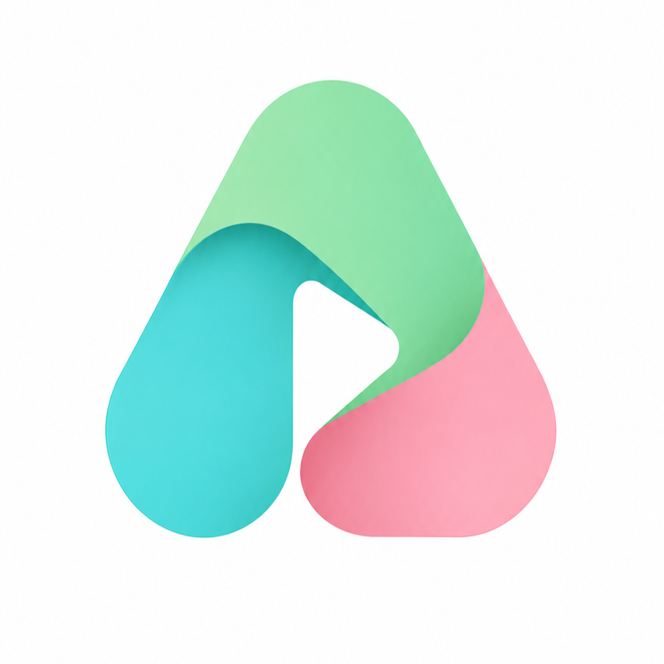

  
  <h1>Anthology - Stremio Addon</h1>
  
Golang tabanlı, yüksek performanslı, dahili video extractor motoruna ve HLS akış proxy'sine sahip Türkçe Dizi, Film, Anime ve Canlı TV eklentisi.

## 🚀 Özellikler

- **Dahili HLS Akış Proxy Motoru (`pkg/proxy`):** Stremio ve Nuvio oynatıcılarının alt segment (`.ts`, `.jpg`, `.js`, `.woff`) isteklerinde `Referer` / `Origin` başlıklarını iletememesinden kaynaklanan HTTP 403 ve 2 saniyede bir donma/takılma sorunlarını çözer. Playlistleri dinamik olarak yeniden yazıp CORS açık şekilde aracı olarak oynatır.
- **Dahili Video Extractor Motoru (`pkg/extractors`):** Stremio'nun web iframe'lerini oynatamama sorununu ortadan kaldırır. OK.ru, Vidmoly, Sibnet, VideoPlay, JWPlayer, Streambox, HDPlayer vb. gömülü oynatıcılardan doğrudan `.m3u8` ve `.mp4` video akışlarını ayıklar.
- **Çoklu Kaynak:** Birçok popüler Türkçe film, dizi ve anime platformundan içerik çeker.
- **Canlı TV:** M3U desteği ile ulusal kanallar, haber kanalları ve sinema kanalları.
- **Hızlı:** Eşzamanlı (concurrent) tarama sayesinde saniyeler içinde sonuç üretir.

## 📊 Kaynak (Sağlayıcı) Durumları

> **Son Güncelleme:** 2 Eylül 2026

Aşağıdaki tablo, sağlayıcıların, video extractor ve HLS proxy motorunun en güncel çalışma durumlarını göstermektedir:

| Sağlayıcı (Kaynak) | Kategori | Durum (Vercel / Cloud) | Durum (Local / Ev Ağı) | Açıklama |
| :--- | :---: | :---: | :---: | :--- |
| **Diziwatch** | Dizi / Anime | ✅ Aktif | ✅ Aktif | VideoPlay HLS extractor + proxy ile 1080p doğrudan ve donmasız oynatılır. |
| **Dizimom** | Dizi | ✅ Aktif | ✅ Aktif | HDPlayer API entegre edildi, dahili HLS proxy ile 1080p doğrudan video oynatılır. |
| **DiziYou** | Dizi | ✅ Aktif | ✅ Aktif | `diziyou.one` entegre edildi. Cloudflare CDN üzerinden 1080p doğrudan HLS akışı getirir. |
| **SeiCode** | Anime | ✅ Aktif | ✅ Aktif | `seicode.net` entegre edildi. Sibnet, Ok.ru ve Vidmoly extractorları ile saf video çeker. |
| **SineWix** | Film & Dizi | ✅ Aktif | ✅ Aktif | Doğrudan CDN & MediaFire MP4/MKV akışları sağlar. |
| **Filmifullizle** | Film | ✅ Aktif | ✅ Aktif | Extractor motoru entegre edildi, doğrudan video akışları sunar. |
| **HDFilmCehennemi**| Film | ✅ Aktif | ✅ Aktif | AJAX player URL'leri extractor motoruna bağlanarak video akışlarına dönüştürüldü. |
| **Sinezy** | Film | ✅ Aktif | ✅ Aktif | Extractor motoru ile doğrudan video akışları sunar. |
| **Filmzal** | Film & Dizi | ✅ Aktif | ✅ Aktif | Extractor motoru ile doğrudan video akışları sunar. |
| **Dizipal** | Dizi & Film | ⚠️ Kısmi | ✅ Aktif | `dizipal1578.com` PBKDF2/SHA512 istemci şifre çözücüsü entegre edildi. |
| **Ddizi** | Dizi | ❌ Cloudflare WAF | ✅ Aktif | Streambox HLS proxy ile parçalı yükleme (2 sn takılma) sorunu tamamen çözüldü. |
| **SetFilmizle** | Film | ✅ Aktif | ✅ Aktif | Kodlar sağlam, veritabanında mevcut olan içerikleri getirir. |
| **Vidmody** | API | ✅ Aktif | ✅ Aktif | TMDB ID ile çalışan API, içerik varsa getirir. |
| **M3U Provider** | IPTV / Canlı | ✅ Aktif | ✅ Aktif | M3U Canlı TV ayrıştırması sorunsuz. |
| **SezonlukDizi** | Dizi | ❌ Cloudflare WAF | ✅ Aktif | Vidmoly/Sibnet/Okru extractorları ile doğrudan videoya dönüştürülür. |
| **Film Makinesi** | Film | ❌ Cloudflare WAF | ✅ Aktif | Vercel IP'lerine 403 Forbidden atıyor. |
| **Dizibox** | Dizi | ❌ Cloudflare WAF | ✅ Aktif | Vercel IP'lerine 403 Forbidden atıyor. |
| **AnimeciX** | Anime | ❌ Cloudflare WAF | ⚠️ Kısmi | Sıkı Cloudflare koruması. |
| **Tranimeizle** | Anime | ❌ Cloudflare WAF | ⚠️ Kısmi | Sıkı Cloudflare koruması. |
| **TurkAnime** | Anime | ❌ Cloudflare WAF | ⚠️ Kısmi | Sıkı Bot koruması mevcut. |
| **YabancıDizi** | Dizi | ❌ Cloudflare WAF | ⚠️ Kısmi | Cloudflare Challenge koruması. |
| **Anizium** | Anime | ❌ SPA | ⚠️ Kısmi | İstemci taraflı SPA mimarisi. |

*Emoji Anlamları:*
* ✅ **Aktif**: Doğrudan `.mp4` veya `.m3u8` video akışı üretir ve Stremio/Nuvio'da tıklandığında anında oynatılır.
* ❌ **Cloudflare WAF**: Kod çalışıyor ve doğrudan video akışı üretiyor ancak hedef site bulut sunucu IP'sini engellediği için akış alınamıyor (Localhost / ev IP'sinde çalışır).
* ⚠️ **Kısmi**: Çok sıkı bot/captcha koruması mevcut.

## 🛠️ Kurulum (Vercel)

Anthology'yi ücretsiz olarak Vercel üzerinde barındırabilirsiniz:

1. Projeyi kendi GitHub hesabınıza Fork'layın veya Clone'layın.
2. Vercel'de yeni bir proje oluşturup bu repoyu seçin.
3. Çevresel Değişkenleri (Environment Variables) ayarlayın:
   - `TMDB_API_KEY`: Kendi TMDB API anahtarınız (Opsiyonel, standart bir key gömülüdür).
   - `PROXY_URL`: Cloudflare Workers Proxy adresiniz (Opsiyonel).
4. Deploy (Yayınla) butonuna basın.

## 🔌 Stremio'ya Ekleme

Vercel veya kendi sunucunuzda (PC/VPS) yayınladıktan sonra Stremio'ya eklemek için:

1. Stremio uygulamasını açın.
2. Arama çubuğuna uygulamanızın adresini sonuna `/manifest.json` ekleyerek yazın.
   - Örnek: `https://senin-anthology-uygulaman.vercel.app/manifest.json` (Veya yerelde çalışıyorsa `http://127.0.0.1:8080/manifest.json`)
3. "Yükle" (Install) butonuna tıklayın.

Hepsi bu kadar! Artık dizi veya filmlere girdiğinizde Anthology kaynakları listelenecektir.
