<div align="center">
  
  <h1>Anthology</h1>
  <p><strong>Nuvio ve Stremio için Doğrulanmış Türkçe Film, Dizi, Anime, Canlı TV ve Zengin Katalog Deposu</strong></p>

  <p>
    <a href="https://github.com/falsisdev/anthology"></a>
    <a href="stremio://falsisdev.github.io/anthology/stremio/manifest.json"></a>
    <a href="https://stremio-addons.net/addons/anthology"></a>
    
    
    
  </p>

  <p>
    <a href="https://falsisdev.github.io/anthology">🌐 <strong>Web Sitesini Ziyaret Et</strong></a> &nbsp;|&nbsp;
    <a href="https://stremio-addons.net/addons/anthology">📦 <strong>Stremio-Addons.net Dizini</strong></a> &nbsp;|&nbsp;
    <a href="stremio://falsisdev.github.io/anthology/stremio/manifest.json">🚀 <strong>Stremio'ya Tek Tıkla Ekle</strong></a> &nbsp;|&nbsp;
    <a href="https://web.stremio.com/#/addons?addon=https%3A%2F%2Ffalsisdev.github.io%2Fanthology%2Fstremio%2Fmanifest.json">📱 <strong>Web Stremio'da Aç</strong></a> &nbsp;|&nbsp;
    <a href="#-sıkça-sorulan-sorular-sss">❓ <strong>SSS</strong></a>
  </p>
</div>

---

> [!IMPORTANT]
> ### ⚠️ Platformlar Arasındaki Kapsam ve Kullanım Farkı:
> - 🌟 **Nuvio Kullanıcıları:** Anthology'nin sunduğu **tüm özellikleri sorunsuz, sınırsız ve eksiksiz** kullanabilir. **37 video scraper motorunun tamamı** (Türkçe/yabancı film, dizi, anime, özel tür arşivleri) ve **100 Canlı TV kanalı (6 vitrin kataloğu)** Nuvio oynatıcısında tek çatı altında eksiksiz çalışır.
> - 🟣 **Stremio Kullanıcıları:** Stremio eklentisi olarak kullanım **yalnızca Canlı TV katalogları (6 vitrin ve 100 canlı yayın kanalı) ile sınırlıdır**. Stremio'nun eklenti protokolü gereği film ve dizi video scraper'ları Stremio üzerinde çalışmaz; bu nedenle Stremio'da yalnızca canlı televizyon ve spor akışları sunulmaktadır.
> - 🌐 **Stremio Topluluk Sayfası:** Eklentiyi resmi Stremio topluluk dizininde incelemek için [stremio-addons.net/addons/anthology](https://stremio-addons.net/addons/anthology) adresini ziyaret edebilirsiniz.

---

## ⚡ 30 Saniyede Hızlı Kurulum

| Platform | Kapsam Durumu | Kurulum Yöntemi | Ne İşe Yarar? |
|---|:---:|---|---|
| 🌟 **Nuvio** *(Önerilen)* | **Tüm Eklenti Sorunsuz & Eksiksiz** | `Ayarlar` → `Pluginler` → `Depo Ekle` yoluna aşağıdaki URL'yi yapıştırın:<br> `https://raw.githubusercontent.com/falsisdev/anthology/main/manifest.json` | **Tüm 34 video motorunu** (film, dizi, anime) ve 100 Canlı TV kanalının tamamını yükler. |
| 🟣 **Stremio** *(Tek Tık)* | **Yalnızca Canlı TV ile Sınırlı** | [**Stremio'ya Doğrudan Ekle (Tıklayın)**](stremio://falsisdev.github.io/anthology/stremio/manifest.json) veya [**Web Stremio'da Aç**](https://web.stremio.com/#/addons?addon=https%3A%2F%2Ffalsisdev.github.io%2Fanthology%2Fstremio%2Fmanifest.json)<br>*(Dizin: [stremio-addons.net](https://stremio-addons.net/addons/anthology))* | **100 Canlı TV kanalını** 6 vitrin kataloğu olarak Stremio ana sayfasına ekler. |

---

## 📲 Kurulum Rehberi

Nuvio ve Stremio'da yerli dizileri, animeleri, sinema filmlerini ve **100 Canlı TV kanalını** hem **ana sayfanızda vitrin olarak görmek** hem de **doğrulanmış resmi CDN akışlarıyla doğrudan oynatmak** için aşağıdaki adımları uygulayın:

---

### 1️⃣ Adım: Video Oynatma Motorunu Ekleyin (Nuvio Pluginleri)
> **Zorunlu (Yalnızca Nuvio):** Bu adım, bir film, dizi veya anime açtığınızda arka planda çalışan **34 Türkçe/yabancı video scraper'ını** Nuvio video motoruna yükler. *(Stremio'da scraper motorları desteklenmez; bu adım Nuvio içindir).*

1. **Nuvio** uygulamasını açın.
2. Sırasıyla **Ayarlar** → **Genel** → **İçerik & Keşif** → **Pluginler** → **Depo Ekle** bölümüne gidin.
3. Aşağıdaki bağlantıyı yapıştırıp **Ekle** butonuna basın:

```text
https://raw.githubusercontent.com/falsisdev/anthology/main/manifest.json
```

---

### 2️⃣ Adım: Canlı TV Ana Sayfa Kataloglarını Ekleyin (Anthology — Canlı TV)
> **Önerilen (Nuvio & Stremio):** Bu adım; 100 Canlı TV kanalını 6 kategoride (**Tüm Kanallar**, **Ulusal**, **Canlı Spor**, **Canlı Haber**, **Belgesel & Çocuk**, **Müzik & Eğlence**) **Nuvio veya Stremio'nun ana sayfa vitrinine** yerleştirir. Tüm kanallar standart **221x126** banner formatındadır.

1. **Nuvio** veya **Stremio** uygulamasında **Eklentiler / Addons** → **Depo / Addon Ekle** bölümüne gidin.
2. Aşağıdaki statik katalog bağlantısını yapıştırıp **Ekle / Install** butonuna basın:

```text
https://falsisdev.github.io/anthology/stremio/manifest.json
```

*(Stremio uygulaması yüklüyse doğrudan **[Buraya Tıklayarak](stremio://falsisdev.github.io/anthology/stremio/manifest.json)** tek tıkla yükleyebilir veya [stremio-addons.net/addons/anthology](https://stremio-addons.net/addons/anthology) topluluk sayfasından kurabilirsiniz.)*

---

> [!TIP]
> **Nasıl Birlikte Çalışırlar?**
> - **Nuvio'da:** 1. Adım ve 2. Adımı birlikte eklediğinizde, Nuvio ana sayfanızda hem zengin Canlı TV vitrinleri görünür hem de içerik aradığınızda 34 video motoru en kaliteli (1080p, 4K, Çift Ses) akışları anında oynatır.
> - **Stremio'da:** Stremio kullanıcıları yalnızca 2. Adımı ekleyerek 100 Canlı TV kanalını kesintisiz resmi CDN bağlantılarıyla izleyebilir.

---

## 📺 Canlı TV Katalogları (6 Resmi Vitrin)

Nuvio ve Stremio ana sayfasında canlı TV kanallarını kategorilere ayrılmış vitrinler olarak sunan kataloglar:

| Katalog | Sağlayıcı | Tür | Kanal Sayısı | İçerik Özeti |
|---|---|:---:|:---:|---|
|  **📺 Canlı TV — Tüm Kanallar** | `ListM3u.js` | Canlı TV | **100** | Türkiye'nin tüm ulusal, haber, spor, belgesel, çocuk ve müzik yayınları |
| 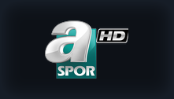 **⚽ Canlı Spor** | `anthology_spor.js` | Canlı TV | **49** | BeIN Sports 1-5, S Sport 1-2, Tivibu Spor 1-4, Exxen Spor 1-8, TRT Spor, A Spor, HT Spor |
| 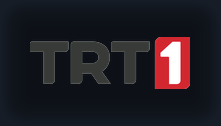 **🇹🇷 Ulusal Kanallar** | `anthology_ulusal.js` | Canlı TV | **19** | TRT 1, ATV, Kanal D, Show, Star, NOW, TV8, Kanal 7, Beyaz TV, Teve2, A2 TV, TV360 vb. |
| 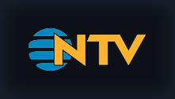 **📰 Canlı Haber** | `anthology_haber.js` | Canlı TV | **18** | NTV, Habertürk, TRT Haber, Sözcü TV, TV100, A Haber, CNN Türk, TVNET, Ülke TV, Ekotürk |
| 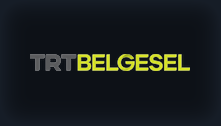 **🦁 Belgesel & Çocuk** | `anthology_belgesel_cocuk.js` | Canlı TV | **7** | TRT Belgesel, Minika Çocuk, Minika GO, TRT Çocuk, TRT EBA İlkokul / Ortaokul / Lise |
|  **🎵 Müzik & Eğlence** | `anthology_muzik.js` | Canlı TV | **7** | Kral Pop TV, Power TV, PowerTürk TV, Number 1 TV, Power Dance, Power Love, TRT Müzik |

---

## 🎬 Doğrulanmış Eklentiler (34 Aktif - Nuvio)

> [!NOTE]
> Aşağıdaki tüm video scraper motorları Nuvio oynatıcısına uygun doğrudan `.m3u8` HLS veya `.mp4`/`.mkv` akışları döndürür.

### 🍿 Film Kaynakları & Arşivleri

| Eklenti | Kaynak / Altyapı | Kalite & Format | İçerik Detayı |
|---|---|:---:|:---:|
| **SineWix** | sinewix.com (snwixdepo) | 1080p Direct MKV | Çift Ses DUAL (Türkçe Dublaj & Altyazı) |
| **FilmModu** | filmmodu.one (ImgsAPI) | 4K & 1080p HLS | Dublaj & Altyazı Seçenekleri |
| **Vidlink** | vidlink.pro (Global CDN) | 4K & 1080p MP4 | Türkçe & Global Çok Dilli |
| **Vidmody** | vidmody.com (Multi-Audio HLS) | 1080p HLS | Çift Ses (Türkçe & İngilizce) + Altyazı |
| **SinemaCX** | sinema.gg (Player.filmizle.in) | 1080p HLS Master | Dublaj & Altyazı Seçenekleri |
| **Webteİzle** | webteizle.info (VidMoly Master) | 1080p HLS | Dublaj & Altyazı Seçenekleri |
| **KultFilmler** | kultfilmler.net (VidMoly/Vidpapi) | 1080p HLS | Kült ve Klasik Sinema Arşivi |
| **HDFilmDelisi** | hdfilmdelisi.org (VidMody HLS) | 1080p HLS | Güncel Filmler ve JSON API Entegrasyonu |

---

### 📺 Dizi Kaynakları & Arşivleri

| Eklenti | Kaynak / Altyapı | Kalite & Format | İçerik Detayı |
|---|---|:---:|:---:|
| **DDizi** | ddizi.im (Fast Ciner / Yandex CDN) | 1080p MP4 / HLS | Yerli Dizi & Güncel Bölümler Arşivi |
| **DiziBak** | dizibak.com (Storage HLS) | 1080p HLS | Yerli ve Yabancı Dizi Arşivi |
| **DiziMom** | dizimom.diy (Fire HLS Master) | 1080p HLS Master | Popüler Yabancı Diziler (Dublaj & Altyazı) |
| **DiziPod** | dizipod.com (player.dizipod.com) | 1080p / 720p HLS | Popüler Yabancı ve Yerli Dizi/Filmler (Altyazı) |
| **DiziYou** | diziyou.one (Storage CDN) | 1080p HLS | Doğrudan Storage CDN + Türkçe VTT Altyazı |
| **YabancıDizi** | yabancidizi.news (VidMoly Master) | 1080p HLS | Popüler Yabancı Diziler Arşivi |
| **SineWix** | sinewix.com (snwixdepo) | 1080p MKV | Dizi Bölümleri Çift Ses DUAL |
| **Vidlink** | vidlink.pro (Global CDN) | 1080p MP4 | Yabancı Dizi Bölümleri |
| **Vidmody** | vidmody.com (Multi-Audio HLS) | 1080p HLS | Çift Ses + Altyazı Dizi Akışları |

---

### ⛩️ Anime & Çizgi Dizi Kaynakları

| Eklenti | Kaynak / Altyapı | Kalite & Format | Dil Desteği |
|---|---|:---:|:---:|
| **AnimeciX** | animecix.tv (TauVideo CDN) | 1080p / 720p / 480p MP4 | Türkçe Altyazı & Dublaj |
| **Anizium** | api.anizium.co (Backblaze CDN) | 4K UHD / 1080p MP4 | Türkçe Dublaj & Senkron WebVTT Altyazı |
| **AsyaAnimeleri** | asyaanimeleri.top (Sibnet & Ok.ru) | 1080p MP4 / HLS | Anime & Donghua Geniş Arşivi |
| **TurkAnime** | turkanime.tv (Sibnet & ArtPlayer) | 1080p MP4 / HLS | Türkiye'nin En Geniş Anime Arşivi |

---

### 📦 Özel Anthology Tür Paketleri

| Eklenti | Tür | Kalite | Açıklama |
|---|:---:|:---:|---|
|  **Anthology Film (M3U)** | Film | 1080p HLS | Lunedor, Zerk ve PowerBoard dublaj/altyazı film arşivi |
|  **Anthology Dizi (M3U)** | Dizi | 1080p MP4/HLS | Zerk ve PowerBoard yerli/yabancı dizi arşivi |
|  **Anthology Aksiyon & Macera** | Tür | 1080p HLS | Aksiyon, macera, suç ve gerilim sineması |
|  **Anthology Bilim Kurgu** | Tür | 1080p HLS | Bilim kurgu, uzay ve fantastik sinema |
|  **Anthology Korku & Gerilim** | Tür | 1080p HLS | Korku, gerilim, gizem ve doğaüstü |
|  **Anthology Komedi** | Tür | 1080p HLS | Yerli & yabancı komedi filmleri |
|  **Anthology Animasyon** | Tür | 1080p HLS | Animasyon, anime ve çizgi sinema |
|  **Anthology Yerli Film & Yeşilçam** | Tür | 1080p HLS/MP4 | Klasik Yeşilçam & Türk Sineması başyapıtları |
|  **Anthology Belgesel & Doğa** | Tür | 1080p HLS | Doğa, bilim ve tarih belgeselleri |
| 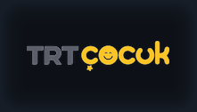 **Anthology Çocuk & Aile** | Tür | 1080p HLS | Çocuk filmleri ve aile sineması |
|  **Anthology IMDb Top Rated** | Tür | 1080p HLS Master | IMDb Top 250 ve en yüksek puanlı ödüllü filmler |
|  **Anthology Yerli Dizi** | Tür | 1080p MP4/HLS | Ciner & Zerk CDN yerli televizyon dizileri |
|  **Anthology Yabancı Dizi** | Tür | 1080p HLS Master | Popüler yabancı diziler dublaj & altyazılı |

---

## 📡 Canlı TV & Spor Kanalları (100 Kanal)

### ⚽ Spor Kanalları (49 Canlı Kanal)

<div align="center">
  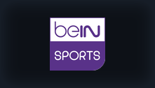 &nbsp;&nbsp;
  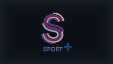 &nbsp;&nbsp;
   &nbsp;&nbsp;
  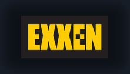 &nbsp;&nbsp;
  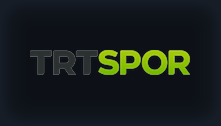 &nbsp;&nbsp;
   &nbsp;&nbsp;
  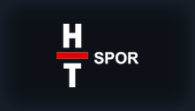 &nbsp;&nbsp;
  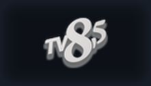
</div>

<br>

- **BeIN Sports:** BeIN Sports 1, 2, 3, 4, 5 HD & BeIN Sports Max 1, Max 2 HD
- **S Sport:** S Sport 1 HD, S Sport 2 HD & S Sport Plus HD
- **Tivibu Spor:** Tivibu Spor HD, Tivibu Spor 1, 2, 3, 4 HD
- **Exxen Spor:** Exxen TV & Exxen Spor 1, 2, 3, 4, 5, 6, 7, 8 HD (Avrupa Maçları)
- **Ulusal & Kulüp Spor:** TRT Spor HD, TRT Spor Yıldız HD, A Spor HD, HT Spor HD, TV8,5 HD, FB TV HD, GS TV HD, TJK TV HD, Sports TV HD, Smart Spor 1-2, EuroSport 1-2, NBA TV, CBC Sport HD, İdman TV HD

---

### 📺 Ulusal, Haber, Belgesel & Müzik Kanalları

<div align="center">
   &nbsp;&nbsp;
  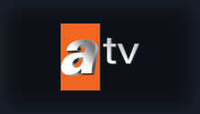 &nbsp;&nbsp;
   &nbsp;&nbsp;
  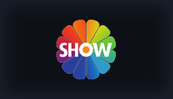 &nbsp;&nbsp;
  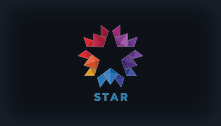 &nbsp;&nbsp;
  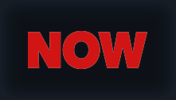 &nbsp;&nbsp;
   &nbsp;&nbsp;
  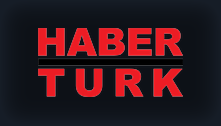 &nbsp;&nbsp;
   &nbsp;&nbsp;
  
</div>

<br>

- **🇹🇷 Ulusal Kanallar (19 Kanal):** TRT 1, ATV, Kanal D, Show TV, Star TV, NOW TV, TV8, Kanal 7, Beyaz TV, Teve2, A2 TV, TV360, TRT 2, TRT Türk, TRT World, TRT Avaz, TRT Kurdî, TRT Arabi, Kanal 7 Avrupa
- **📰 Haber Kanalları (18 Kanal):** TRT Haber, NTV, Habertürk, TV100, Sözcü TV, A Haber, CNN Türk, Halk TV, Tele 1, TGRT Haber, Haber Global, 24 TV, Bloomberg HT, TVNET, Ülke TV, Ekotürk, Bengü Türk, Flash Haber
- **🦁 Belgesel & Çocuk (7 Kanal):** TRT Belgesel HD, TRT Çocuk HD, Minika Çocuk HD, Minika GO HD, TRT EBA İlkokul, TRT EBA Ortaokul, TRT EBA Lise
- **🎵 Müzik & Eğlence (7 Kanal):** Kral Pop TV HD, Power TV HD, PowerTürk TV HD, Number 1 TV HD, Power Dance HD, Power Love HD, TRT Müzik HD

---

## ⚠️ **Çalışmayan / Deprecated Sağlayıcılar**

Aşağıdaki sağlayıcılar kaynak/CDN/API değişiklikleri nedeniyle **şu anda çalışmamaktadır** ve manifest'ta `enabled: false` olarak işaretlenmiştir. Kod arşivlenmiştir, gelecekte kaynak düzelirse yeniden etkinleştirilebilir.

| Sağlayıcı | Durum | Kök Neden | Not |
|---|---|---|---|
| **SetFilmIzle** | ❌ **Çalışmıyor** | FastPlay X-Sp single-use token | Native player'da oynatılamıyor |
| **HDFilmIzle** | ❌ **Çalışmıyor** | FastPlay X-Sp single-use token | Native player'da oynatılamıyor |

> **Not:** Bu listedeki provider kodları **doğrudur**; sorun dış CDN/API/kaynakta. Kaynak sahipleri düzelirse tekrar etkinleştirilebilir.

---

## ❓ Sıkça Sorulan Sorular (SSS)

<details>
<summary><strong>1. Anthology tamamen ücretsiz mi? Reklam var mı?</strong></summary>
<br>
Evet! Anthology %100 açık kaynaklı ve kâr amacı gütmeyen bir topluluk projesidir. Kesinlikle üyelik, ücret ya da araya giren video reklamı içermez.
</details>

<details>
<summary><strong>2. Nuvio mu Stremio mu kullanmalıyım? Aralarındaki fark nedir?</strong></summary>
<br>
<p><strong>Nuvio Kullanıcıları:</strong> Anthology'nin tüm özelliklerini sınırsız kullanabilir. 37 adet film, dizi ve anime video scraper motorunun tamamı ile 6 Canlı TV kataloğu ve 100 canlı yayın kanalı Nuvio'da eksiksiz çalışır.</p>
<p><strong>Stremio Kullanıcıları:</strong> Stremio eklentisi olarak kullanım <strong>yalnızca Canlı TV katalogları (6 vitrin ve 100 kanal)</strong> ile sınırlıdır. Film ve dizi motorları Stremio'da yer almaz. Resmi topluluk dizini için <a href="https://stremio-addons.net/addons/anthology">stremio-addons.net/addons/anthology</a> adresini ziyaret edebilirsiniz.</p>
</details>

<details>
<summary><strong>3. Canlı TV yayınları neden donmuyor ve hızlı açılıyor?</strong></summary>
<br>
Yayınlar televizyon kanallarının ve platformların resmi CDN (Akamai, Daion, Demirören ErCDN, Ciner vb.) altyapılarından doğrudan <code>.m3u8</code> HLS formatında temin edilir. Bu sayede harici web sitelerinin reklam veya yavaşlatıcı katmanlarına takılmadan doğrudan oynatıcıya akar.
</details>

<details>
<summary><strong>4. TV Box ve Android TV'de en iyi oynatıcı hangisidir?</strong></summary>
<br>
Nuvio ayarlarında oynatıcı olarak <strong>ExoPlayer</strong> veya <strong>VLC</strong> seçilmesi önerilir. Donanım hızlandırma (HW Acceleration) açık olduğunda 1080p ve 4K yayınlar sıfır takılmayla oynatılır.
</details>

<details>
<summary><strong>5. Eklenti ve yayın güncellemelerini nasıl alırım?</strong></summary>
<br>
Depoyu bir kez eklemeniz yeterlidir. Eklentiler ve yayın linkleri GitHub üzerinden güncellendikçe Nuvio ve Stremio her açılışta güncel listeyi otomatik olarak çeker.
</details>

---

## 🧪 Test ve Bütünlük Doğrulama

Tüm eklentiler, Stremio katalogları ve akış sağlayıcıları entegrasyon testleriyle doğrulanabilir:

```bash
# Stremio Anthology — Canlı TV meta ve katalog bütünlük testini çalıştırın:
node scripts/test_stremio_addon.js

# Tüm katalogların öğe çekme testini çalıştırın:
node scripts/test_all_catalogs.js
```

---

## 📄 Lisans & Yasal Uyarı

Bu proje [GPL-3.0](LICENSE) lisansı altında sunulmaktadır. Anthology sunucularında hiçbir video veya yayın barındırılmaz; proje yalnızca kamuya açık resmi CDN ve web kaynaklarını dizinleyen açık kaynaklı bir arayüz ve eklenti deposudur.
