<div align="center">
  
  <h1>Anthology</h1>
  <p><strong>Nuvio ve Stremio için Doğrulanmış Türkçe Film, Dizi, Anime, Canlı TV ve Zengin Katalog Deposu</strong></p>

  <p>
    <a href="https://github.com/falsisdev/anthology"></a>
    <a href="stremio://falsisdev.github.io/anthology/stremio/manifest.json"></a>
    <a href="https://stremio-addons.net/addons/anthology"></a>
  </p>

  <p>
    
    
    
    
    
  </p>

  <p>
    <a href="https://falsisdev.github.io/anthology">🌐 <strong>Web Sitesini Ziyaret Et</strong></a> &nbsp;|&nbsp;
    <a href="https://stremio-addons.net/addons/anthology">📦 <strong>Stremio-Addons.net Dizini</strong></a> &nbsp;|&nbsp;
    <a href="stremio://falsisdev.github.io/anthology/stremio/manifest.json">🚀 <strong>Stremio'ya Tek Tıkla Ekle</strong></a> &nbsp;|&nbsp;
    <a href="https://web.stremio.com/#/addons?addon=https%3A%2F%2Ffalsisdev.github.io%2Fanthology%2Fstremio%2Fmanifest.json">📱 <strong>Web Stremio'da Aç</strong></a> &nbsp;|&nbsp;
    <a href="#-sıkça-sorulan-sorular-sss">❓ <strong>SSS</strong></a>
  </p>
</div>

---

> [!IMPORTANT]
> ### ⚠️ Platformlar Arasındaki Kapsam ve Kullanım Farkı:
> - 🌟 **Nuvio Kullanıcıları:** Anthology'nin sunduğu **tüm özellikleri sorunsuz, sınırsız ve eksiksiz** kullanabilir. **40 eklentinin tamamı** (Türkçe/yabancı film, dizi, anime, özel tür arşivleri) ve **138 Canlı TV kanalı (7 vitrin kataloğu)** Nuvio oynatıcısında tek çatı altında eksiksiz çalışır.
> - 🟣 **Stremio Kullanıcıları:** Stremio eklentisi olarak kullanım **yalnızca Canlı TV katalogları (7 vitrin ve 138 canlı yayın kanalı) ile sınırlıdır**. Stremio'nun eklenti protokolü gereği film ve dizi video scraper'ları Stremio üzerinde çalışmaz; bu nedenle Stremio'da yalnızca canlı televizyon ve spor akışları sunulmaktadır.
> - 🌐 **Stremio Topluluk Sayfası:** Eklentiyi resmi Stremio topluluk dizininde incelemek için [stremio-addons.net/addons/anthology](https://stremio-addons.net/addons/anthology) adresini ziyaret edebilirsiniz.

---

## ⚡ 30 Saniyede Hızlı Kurulum

| Platform | Kapsam Durumu | Kurulum Yöntemi | Ne İşe Yarar? |
|---|:---:|---|---|
| 🌟 **Nuvio** *(Önerilen)* | **Tüm Eklenti Sorunsuz & Eksiksiz** | `Ayarlar` → `Pluginler` → `Depo Ekle` yoluna aşağıdaki URL'yi yapıştırın:<br> `https://raw.githubusercontent.com/falsisdev/anthology/main/manifest.json` | **Tüm 40 eklentiyi** (film, dizi, anime ve canlı TV kanalları) yükler. |
| 🟣 **Stremio** *(Tek Tık)* | **Yalnızca Canlı TV ile Sınırlı** | [**Stremio'ya Doğrudan Ekle (Tıklayın)**](stremio://falsisdev.github.io/anthology/stremio/manifest.json) veya [**Web Stremio'da Aç**](https://web.stremio.com/#/addons?addon=https%3A%2F%2Ffalsisdev.github.io%2Fanthology%2Fstremio%2Fmanifest.json)<br>*(Dizin: [stremio-addons.net](https://stremio-addons.net/addons/anthology))* |**138 Canlı TV kanalını** 7 vitrin kataloğu olarak Stremio ana sayfasına ekler. |

---

## 📲 Kurulum Rehberi

Nuvio ve Stremio'da yerli dizileri, animeleri, sinema filmlerini ve **138 Canlı TV kanalını** hem **ana sayfanızda vitrin olarak görmek** hem de **doğrulanmış resmi CDN akışlarıyla doğrudan oynatmak** için aşağıdaki adımları uygulayın:

---

### 1️⃣ Adım: Video Oynatma Motorunu Ekleyin (Nuvio Pluginleri)
> **Zorunlu (Yalnızca Nuvio):** Bu adım, bir film, dizi veya anime açtığınızda arka planda çalışan **40 Türkçe/yabancı eklentiyi** Nuvio video motoruna yükler. *(Stremio'da scraper motorları desteklenmez; bu adım Nuvio içindir).*

1. **Nuvio** uygulamasını açın.
2. Sırasıyla **Ayarlar** → **Genel** → **İçerik & Keşif** → **Pluginler** → **Depo Ekle** bölümüne gidin.
3. Aşağıdaki bağlantıyı yapıştırıp **Ekle** butonuna basın:

```text
https://raw.githubusercontent.com/falsisdev/anthology/main/manifest.json
```

---

### 2️⃣ Adım: Canlı TV Ana Sayfa Kataloglarını Ekleyin (Anthology — Canlı TV)
> **Önerilen (Nuvio & Stremio):** Bu adım; 138 Canlı TV kanalını 7 kategoride (**Tüm Kanallar**, **Canlı Spor**, **Ulusal**, **Canlı Haber**, **Belgesel & Çocuk**, **Sinema**, **Müzik & Eğlence**) **Nuvio veya Stremio'nun ana sayfa vitrinine** yerleştirir. Tüm kanallar standart **221x126** banner formatındadır.

1. **Nuvio** veya **Stremio** uygulamasında **Eklentiler / Addons** → **Depo / Addon Ekle** bölümüne gidin.
2. Aşağıdaki statik katalog bağlantısını yapıştırıp **Ekle / Install** butonuna basın:

```text
https://falsisdev.github.io/anthology/stremio/manifest.json
```

*(Stremio uygulaması yüklüyse doğrudan **[Buraya Tıklayarak](stremio://falsisdev.github.io/anthology/stremio/manifest.json)** tek tıkla yükleyebilir veya [stremio-addons.net/addons/anthology](https://stremio-addons.net/addons/anthology) topluluk sayfasından kurabilirsiniz.)*

---

> [!TIP]
> **Nasıl Birlikte Çalışırlar?**
> - **Nuvio'da:** 1. Adım ve 2. Adımı birlikte eklediğinizde, Nuvio ana sayfanızda hem zengin Canlı TV vitrinleri görünür hem de içerik aradığınızda 40 eklenti en kaliteli (1080p, 4K, Çift Ses) akışları anında oynatır.
> - **Stremio'da:** Stremio kullanıcıları yalnızca 2. Adımı ekleyerek 138 Canlı TV kanalını kesintisiz resmi CDN bağlantılarıyla izleyebilir.

---

## 📺 Canlı TV Katalogları (7 Resmi Vitrin)

Nuvio ve Stremio ana sayfasında canlı TV kanallarını kategorilere ayrılmış vitrinler olarak sunan kataloglar:

| Katalog | Sağlayıcı | Tür | Kanal Sayısı | İçerik Özeti |
|---|---|:---:|:---:|---|
|  **📺 Canlı TV — Tüm Kanallar** | `ListM3u.js` | Canlı TV | **138** | Türkiye'nin tüm ulusal, haber, spor, belgesel, çocuk, sinema ve müzik yayınları |
|  **⚽ Canlı Spor** | `anthology_spor.js` | Canlı TV | **55** | B-In Sports 1-5, Es Sport 1-2, TV-Bu Spor 1-4, Eksen Spor 1-8, Tab11 Spor 1-8, TRT Spor, A Spor, HT Spor, Mahsun Sports maç kanalı |
| 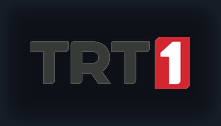 **🇹🇷 Ulusal Kanallar** | `anthology_ulusal.js` | Canlı TV | **25** | TRT 1, ATV, Kanal D, Show, Star, NOW, TV8, Kanal 7, Beyaz TV, Teve2, A2 TV, TV360, TRT Genç vb. |
| 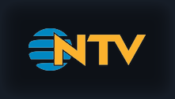 **📰 Canlı Haber** | `anthology_haber.js` | Canlı TV | **27** | NTV, Habertürk, TRT Haber, Sözcü TV, TV100, A Haber, CNN Türk, CNBC-e, TBMM TV, BBC News |
| 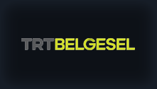 **🦁 Belgesel & Çocuk** | `anthology_belgesel_cocuk.js` | Canlı TV | **12** | TRT Belgesel, Minika Çocuk, Minika GO, TRT Çocuk, TLC, DMAX, TRT EBA İlkokul / Ortaokul / Lise |
|  **🎵 Müzik & Eğlence** | `anthology_muzik.js` | Canlı TV | **16** | Kral Pop TV, Power TV, PowerTürk TV, Number 1 TV, Dream Türk, TMB TV, Power Dance, Power Love, TRT Müzik |
| 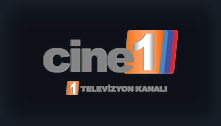 **🎬 Sinema** | `anthology_sinema.js` | Canlı TV | **3** | Cine 1 HD, FX HD, TRT Nostalji HD yayın akışları |

---

## 🎬 Doğrulanmış Eklentiler (40 Aktif - Nuvio)

> [!NOTE]
> Aşağıdaki tüm video scraper motorları Nuvio oynatıcısına uygun doğrudan `.m3u8` HLS veya `.mp4`/`.mkv` akışları döndürür.

### 🍿 Film Kaynakları & Arşivleri

| Eklenti | Kaynak / Altyapı | Kalite & Format | İçerik Detayı |
|---|---|:---:|:---:|
| **SineWix** | sinewix.com (snwixdepo) | 1080p Direct MKV | Çift Ses DUAL (Türkçe Dublaj & Altyazı) |
| **HDFilmCehennemi** | hdfilmcehennemi.nl (CloseLoad) | 1080p HLS Master | Çift Ses DUAL (TR Dublaj & Orijinal) + Çoklu Altyazı |
| **FilmModu** | filmmodu.one (ImgsAPI) | 4K & 1080p HLS | Dublaj & Altyazı Seçenekleri |
| **Vidlink** | vidlink.pro (Global CDN) | 4K & 1080p MP4 | Türkçe & Global Çok Dilli |
| **Vidmody** | vidmody.com (Multi-Audio HLS) | 1080p HLS | Çift Ses (Türkçe & İngilizce) + Altyazı |
| **SinemaCX** | sinema.gg (Player.filmizle.in) | 1080p HLS Master | Dublaj & Altyazı Seçenekleri |
| **Webteİzle** | webteizle.info (VidMoly Master) | 1080p HLS | Dublaj & Altyazı Seçenekleri |
| **KultFilmler** | kultfilmler.net (VidMoly/Vidpapi) | 1080p HLS | Kült ve Klasik Sinema Arşivi |
| **HDFilmDelisi** | hdfilmdelisi.org (VidMody HLS) | 1080p HLS | Güncel Filmler ve JSON API Entegrasyonu |
| **HDFilmIzle** | hdfilmizle.vip (Vidrame/Vidmoxy/FastPlay) | 1080p HLS Master | Çift Ses DUAL (TR Dublaj & Altyazı) + Çoklu VTT |
| **LiderFilm** | liderfilmizle.vip (play.liderfilm.cc VOD / ag2m4 embed) | 1080p HLS Master | Yerli & Yabancı Film ve Dizi Arşivi, Senkronize VTT Altyazı |
| **YouTube Dizi & Film** | youtube.com (Resmi Kanallar & Arşivler) | 1080p Resmî Akış / MP4 | Klasik Yeşilçam & Türk Sineması, BKM, Arzu Film ve Fanatik Arşivleri |

---

### 📺 Dizi Kaynakları & Arşivleri

| Eklenti | Kaynak / Altyapı | Kalite & Format | İçerik Detayı |
|---|---|:---:|:---:|
| **DDizi** | ddizi.im (Fast Ciner / Yandex CDN) | 1080p MP4 / HLS | Yerli Dizi & Güncel Bölümler Arşivi |
| **DiziBak** | dizibak.net (Storage HLS) | 1080p HLS | Yerli ve Yabancı Dizi Arşivi |
| **DiziMom** | dizimom.diy (Fire HLS Master) | 1080p HLS Master | Popüler Yabancı Diziler (Dublaj & Altyazı) |
| **DiziPod** | dizipod.com (player.dizipod.com) | 1080p / 720p HLS | Popüler Yabancı ve Yerli Dizi/Filmler (Altyazı) |
| **DiziBoxİzle** | diziboxizle.com (VidMoly & Ok.ru) | 1080p HLS / MP4 | Güncel Yabancı Diziler & Bölümler Arşivi |
| **DiziWatch** | diziwatch.ac (Pichive Player / Embed) | 1080p HLS / MP4 | Güncel Anime ve Yabancı Diziler Arşivi |
| **DiziYou** | diziyou.one (Storage CDN) | 1080p HLS | Doğrudan Storage CDN + Türkçe VTT Altyazı |
| **LiderFilm** | liderfilmizle.vip (JWPlayer / ag2m4) | 1080p HLS Master | Yerli & Yabancı Dizi Bölümleri, VTT Altyazı |
| **YouTube Dizi & Film** | youtube.com (Resmi TV & Yapımcı Kanalları) | 1080p Resmî Akış / MP4 | Resmî Türk Dizileri (Kurtlar Vadisi, Ezel, Aşk-ı Memnu vb.), Kümülatif Bölüm Eşleştirme |
| **SetFilmIzle** | setfilmizle.ltd (FastPlay/SetPlay) | 1080p HLS Master | Çift Ses DUAL + Türkçe/İngilizce Altyazı (Film & Dizi) |
| **YabancıDizi** | yabancidizi.news (VidMoly Master) | 1080p HLS | Popüler Yabancı Diziler Arşivi |
| **TvDiziler** | tvdiziler.tv (Twitter Amplify / Ciner / YouTube) | 1080p HLS / MP4 | Yerli TV Dizileri & Güncel Bölümler Arşivi |
| **Anthology Dizi** | NOW / Show TV / KanalD / Star TV / ATV / TRT1 (resmi arşivler) | 1080p HLS | TV Ağı bölümleri — TMDB eşleştirmeli, sabit harita yok |
| **PuhuTV** | puhutv.com (DYG → mncdn) | 1080p HLS | PuhuTV arşivi + Türkçe altyazı |
| **TR Dizi İzle** | trdiziizle.tv/tr2 (WP + embed) | HLS / MP4 | Yerli dizi arşivi (Cloudflare korumalı ise boş) |
| **SineWix** | sinewix.com (snwixdepo) | 1080p MKV | Dizi Bölümleri Çift Ses DUAL |
| **Vidlink** | vidlink.pro (Global CDN) | 1080p MP4 | Yabancı Dizi Bölümleri |
| **Vidmody** | vidmody.com (Multi-Audio HLS) | 1080p HLS | Çift Ses + Altyazı Dizi Akışları |

---

### ⛩️ Anime & Çizgi Dizi Kaynakları

| Eklenti | Kaynak / Altyapı | Kalite & Format | Dil Desteği |
|---|---|:---:|:---:|
| **AnimeciX** | animecix.tv (TauVideo CDN) | 1080p / 720p / 480p MP4 | Türkçe Altyazı & Dublaj |
| **Anizium** | api.anizium.co (Backblaze CDN) | 4K UHD / 1080p MP4 | Türkçe Dublaj & Senkron WebVTT Altyazı |
| **AsyaAnimeleri** | asyaanimeleri.top (Sibnet & Ok.ru) | 1080p MP4 / HLS | Anime & Donghua Geniş Arşivi |
| **Anizm** | anizm.net (AnizmPlayer & Ok.ru & Sibnet) | 720p HLS / MP4 | Türkçe Anime Akışları |
| **AniMOM** | animom.org (HDPlayer & Sibnet & YourUpload) | 720p HLS / MP4 | Türkçe Anime Akışları |
| **AnimePraX** | animeprax.com (Sibnet & Ok.ru & Dailymotion) | 1080p MP4 / HLS | Türkçe Anime Akışları |
| **SeiCode** | seicode.net (TauVideo, OkRu, Sibnet, VidMoly, MP4Upload) | 1080p MP4 / HLS | Güncel Anime Serileri & Doğrudan Akışlar |
| **SonAnime** | sonanime.com (Backblaze B2 & Cloudflare CDN) | 1080p / 720p / 480p MP4 | Türkçe Altyazılı Geniş Anime & Film Arşivi |

---

### 📦 Anthology M3U Paketi

| Eklenti | Tür | Kalite | Açıklama |
|---|:---:|:---:|---|
|  **Anthology M3U** | Film / Dizi | 1080p HLS / MP4 | Lunedor, Zerk ve PowerBoard dublaj/altyazı on binlerce yerli & yabancı film ve dizi arşivi |

---

## 📡 Canlı TV & Spor Kanalları (138 Kanal)

### ⚽ Spor Kanalları (55 Canlı Kanal)

<div align="center">
   &nbsp;&nbsp;
   &nbsp;&nbsp;
   &nbsp;&nbsp;
   &nbsp;&nbsp;
  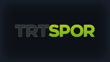 &nbsp;&nbsp;
  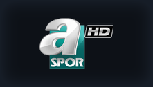 &nbsp;&nbsp;
  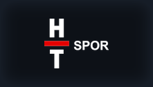 &nbsp;&nbsp;
  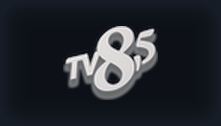
</div>

<br>

- **B-In Sports:** B-In Sports 1, 2, 3, 4, 5 HD & B-In Sports Max 1, Max 2 HD
- **Es Sport:** Es Sport 1 HD, Es Sport 2 HD & Es Sport Plus HD
- **TV-Bu Spor:** TV-Bu Spor HD, TV-Bu Spor 1, 2, 3, 4 HD
- **Eksen Spor:** Eksen TV & Eksen Sports 1, 2, 3, 4, 5, 6, 7, 8 HD (Avrupa Maçları)
- **Akıllı Spor & Avro Sport & Tab11 Spor:** Akıllı Spor 1-2 HD, Avro Sport 1-2 HD, Tab11 Spor 1-8 HD
- **Ulusal & Kulüp Spor:** TRT Spor HD, TRT Spor Yıldız HD, A Spor HD, HT Spor HD, TV8,5 HD, FB TV HD, GS TV HD, TJK TV HD, Sports TV HD, NBA TV, CBC Sport HD, İdman TV HD
- **Özel & Uluslararası Spor:** Mahsun Sports, Tay TV HD, Real Madrid TV HD, Red Bull TV HD, NHL Network HD, UFC Network HD, Sport Fishing TV HD

---

### 📺 Ulusal, Haber, Belgesel & Müzik Kanalları

<div align="center">
   &nbsp;&nbsp;
  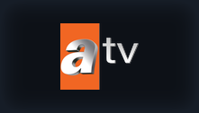 &nbsp;&nbsp;
   &nbsp;&nbsp;
  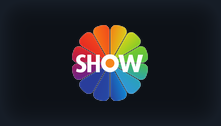 &nbsp;&nbsp;
  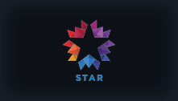 &nbsp;&nbsp;
   &nbsp;&nbsp;
   &nbsp;&nbsp;
  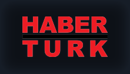 &nbsp;&nbsp;
   &nbsp;&nbsp;
  
</div>

<br>

- **🇹🇷 Ulusal Kanallar (25 Kanal):** TRT 1, ATV, Kanal D, Show TV, Star TV, NOW TV, TV8, Kanal 7, Beyaz TV, Teve2, A2 TV, TV360, TRT 2, TRT Türk, Kanal 7 Avrupa, TRT Genç, Euro D, TV4, TYT Türk, Kanal Avrupa, TRT World, TRT Avaz, TRT Kurdî, TRT Arabi, Diyanet TV
- **📰 Haber Kanalları (27 Kanal):** TRT Haber, NTV, Habertürk, TV100, A Haber, Halk TV, Tele 1, TGRT Haber, Haber Global, 24 TV, Bloomberg HT, TVNET, Ülke TV, Ekotürk, Bengü Türk, Flash Haber, Lider Haber, Türk Haber, CNBC-e, Akit TV, TBMM TV, Finans Türk, BBC News, CBS News, Fox News, France 24, Reuters TV
- **🦁 Belgesel & Çocuk (12 Kanal):** TRT Belgesel HD, TRT Çocuk HD, Minika Çocuk HD, Minika GO HD, TRT EBA İlkokul, TRT EBA Ortaokul, TRT EBA Lise, TRT Diyanet Çocuk, Çiftçi TV, Travelxp HD, TLC HD, DMAX HD
- **🎵 Müzik & Eğlence (16 Kanal):** Kral Pop TV HD, PowerTürk TV HD, Power TV HD, Number 1 TV HD, TRT Müzik HD, Power Dance, Power Love, Dream Türk, TMB TV, Show Max, Powertürk Taptaze, Powertürk Slow, Powertürk Akustik, Number 1 Aşk, Number 1 Damar, Number 1 Dance
- **🎬 Sinema (3 Kanal):** Cine 1 HD, FX HD, TRT Nostalji HD

---

## ⚠️ **Çalışmayan / Doğrulanamayan Sağlayıcılar**

Repoda yer alan **tüm 33 video sağlayıcısı ve 7 Canlı TV kategorisi (toplam 40 eklenti)** genel olarak aktif ve doğrulanmış olarak çalışmaktadır. Tek istisna, bu sunucudan Cloudflare koruması nedeniyle doğrulanamayan sağlayıcıdır:

- **Anizm (`anizm.net`):** AnizmPlayer (FirePlayer HLS), OK.ru ve Sibnet ağları için arama/çeviri/bölüm sayfaları açık; ancak `/video/...` ve `/player/...` rotaları Cloudflare challenge döndüğü için bu sunucudan `getStreams` doğrulanamıyor (boş döner). Ev IP'sinde tarayıcıyla CF geçildiğinde çalışabilir — kod sağlıklı, ağ kısıtı.
- **trdiziizle (`trdiziizle.tv/tr2`):** WordPress şablonu; arama (`/?s=`) ve bölüm sayfaları CF challenge'lı olduğundan bu sunucudan doğrulanamıyor. Ev ağında çalışabilir.
- **SinemaCX (`sinema.gg`):** filmizle.in ailesi bu ağdan tamamen erişilemez (Cloudflare reset) — çevresel blok, kod hatası değil.

---

## ❓ Sıkça Sorulan Sorular (SSS)

<details>
<summary><strong>1. Anthology tamamen ücretsiz mi? Reklam var mı?</strong></summary>
<br>
Evet! Anthology %100 açık kaynaklı ve kâr amacı gütmeyen bir topluluk projesidir. Kesinlikle üyelik, ücret ya da araya giren video reklamı içermez.
</details>

<details>
<summary><strong>2. Nuvio mu Stremio mu kullanmalıyım? Aralarındaki fark nedir?</strong></summary>
<br>
<p><strong>Nuvio Kullanıcıları:</strong> Anthology'nin tüm özelliklerini sınırsız kullanabilir. 40 adet film, dizi ve anime video scraper motorunun tamamı ile 7 Canlı TV kataloğu ve 138 canlı yayın kanalı Nuvio'da eksiksiz çalışır.</p>
<p><strong>Stremio Kullanıcıları:</strong> Stremio eklentisi olarak kullanım <strong>yalnızca Canlı TV katalogları (7 vitrin ve 138 kanal)</strong> ile sınırlıdır. Film ve dizi motorları Stremio'da yer almaz. Resmi topluluk dizini için <a href="https://stremio-addons.net/addons/anthology">stremio-addons.net/addons/anthology</a> adresini ziyaret edebilirsiniz.</p>
</details>

<details>
<summary><strong>3. Canlı TV yayınları neden donmuyor ve hızlı açılıyor?</strong></summary>
<br>
Yayınlar televizyon kanallarının ve platformların resmi CDN (Akamai, Daion, Demirören ErCDN, Ciner vb.) altyapılarından doğrudan <code>.m3u8</code> HLS formatında temin edilir. Bu sayede harici web sitelerinin reklam veya yavaşlatıcı katmanlarına takılmadan doğrudan oynatıcıya akar.
</details>

<details>
<summary><strong>4. TV Box ve Android TV'de en iyi oynatıcı hangisidir?</strong></summary>
<br>
Nuvio ayarlarında oynatıcı olarak <strong>ExoPlayer</strong> veya <strong>VLC</strong> seçilmesi önerilir. Donanım hızlandırma (HW Acceleration) açık olduğunda 1080p ve 4K yayınlar sıfır takılmayla oynatılır.
</details>

<details>
<summary><strong>5. Eklenti ve yayın güncellemelerini nasıl alırım?</strong></summary>
<br>
Depoyu bir kez eklemeniz yeterlidir. Eklentiler ve yayın linkleri GitHub üzerinden güncellendikçe Nuvio ve Stremio her açılışta güncel listeyi otomatik olarak çeker.
</details>

---

## 🧪 Test ve Bütünlük Doğrulama

Tüm eklentiler, Stremio katalogları ve akış sağlayıcıları entegrasyon testleriyle doğrulanabilir:

```bash
# Stremio Anthology — Canlı TV meta ve katalog bütünlük testini çalıştırın:
node scripts/test_stremio_addon.js

# Tüm katalogların öğe çekme testini çalıştırın:
node scripts/test_all_catalogs.js
```

---

## 🤝 Katkıda Bulunanlar

Anthology açık kaynak topluluğunun katkılarıyla gelişmektedir. Katkı sağlayan geliştiricilere teşekkürler:

- **Mustafa Esat Temel** ([@MustafaEsatTemel](https://github.com/MustafaEsatTemel) / `metemel`) — **LiderFilm** (`liderfilmizle.vip`) ve **YouTube Dizi & Film** resmî arşiv sağlayıcı entegrasyonları.

---

## 📜 Krediler & Atıflar (Credits & Acknowledgements)

Anthology projesinin gelişiminde faydalanılan harici açık kaynak katalog, kaynak dizini ve veri sağlayıcılarına teşekkür ederiz:

- **Wiojelt** ([@Wiojelt](https://github.com/Wiojelt)) — [TurkSpor](https://github.com/Wiojelt/TurkSpor) ve [WioSpor](https://github.com/Wiojelt/WioSpor) projelerindeki spor kataloğu yapısı, NetVGold akış referansları ve alternatif canlı yayın akışı kaynakları.
- **iptv-org** ([iptv-org](https://github.com/iptv-org)) — Kamuya açık kanal dizinleri ve topluluk logo veritabanı.
- **mooncrown04** ([mooncrown04](https://github.com/mooncrown04)) — M3U film ve dizi parçaları veritabanı altyapısı.

---

## 📄 Lisans & Yasal Uyarı

Anthology açık kaynaklı bir topluluk projesidir. Anthology sunucularında hiçbir video veya yayın barındırılmaz; proje yalnızca kamuya açık resmi CDN ve web kaynaklarını dizinleyen bir arayüz ve eklenti deposudur.

> [!IMPORTANT]
> Anthology eklentisinin kullanıcıya sunduğu tüm içerikler “video paylaşım siteleri” aracılığıyla paylaşılmaktadır. Anthology kendi sunucularında herhangi bir içerik barındırmadığından, bu konuda bir telif hakkı sorumluluğu kabul etmemektedir.